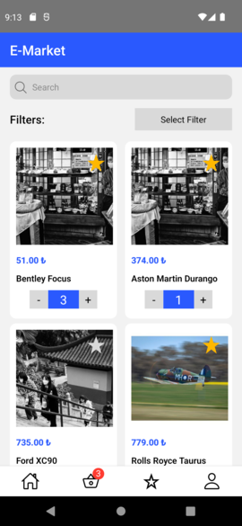
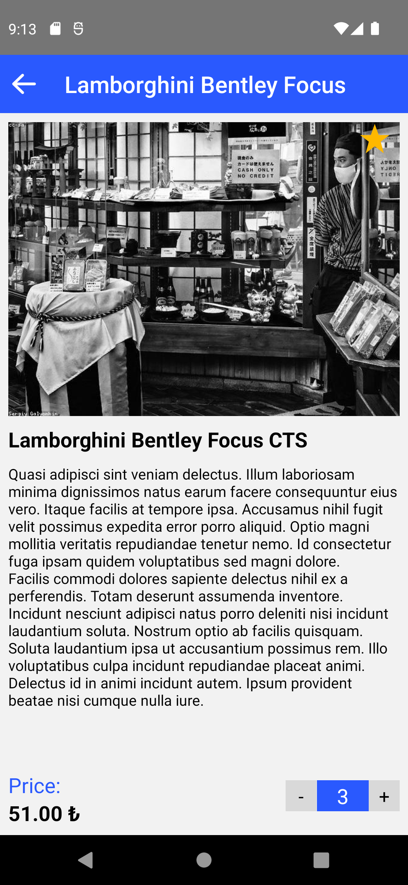
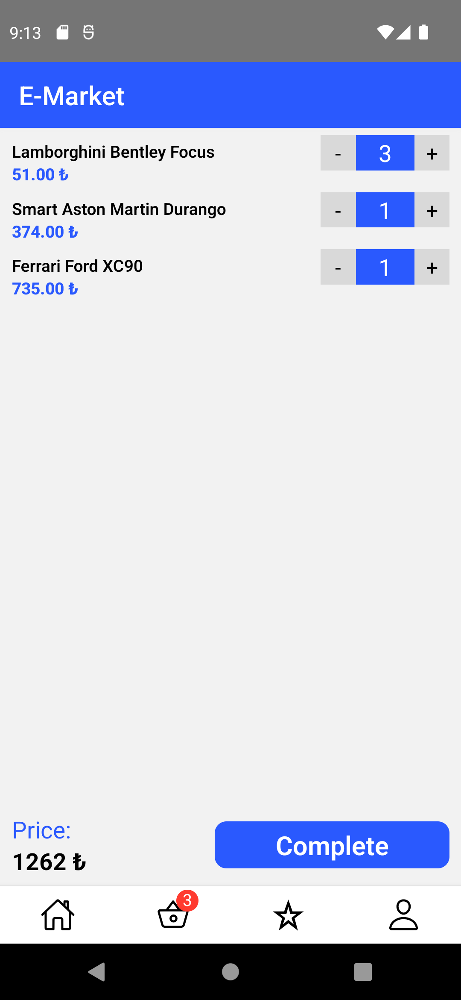
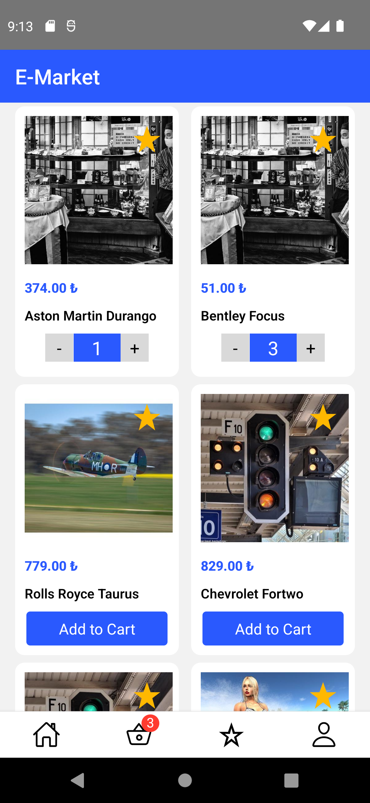
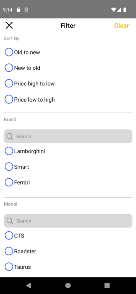
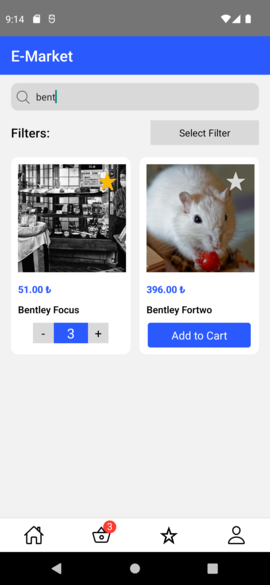
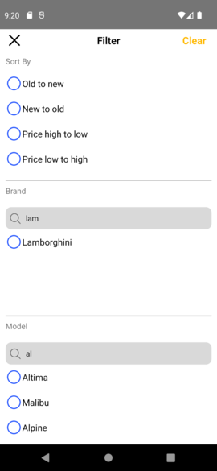

# Case Study

## Description

The application includes features such as listing the products purchased via API, adding/removing them to favorites, adding/removing them to the cart, filtering, sorting and searching, and a detail page where the features of the product are shown.

# Screenshots










## Getting Started

### Dependencies

- @react-navigation/native
- @react-navigation/native-stack
- @react-navigation/bottom-tabs
- react-native-fast-image
- react-native-safe-area-context
- react-native-screens
- react-native-vector-icons
- @react-native-async-storage/async-storage

### Key Decisions

- StackNavigator & Tab Navigator used for navigation operations within the application.
- Infinite scroll structure used with FlatList for displaying products.
- UseContext was used for global state management.
- react-native-vector-icons library was used for the icons in the application.
- The products added to the cart and favorites were stored with @react-native-async-storage/async-storage library, display of the data was activated even if the application was closed.
- Features such as searching, sorting, filtering were displayed to the user by making API calls, and modals were used for the design.
- Jest was preffered for unit testing.
- The number of products in the cart was displayed using tabBarBadge (Context used)
- AddtoCart reusable component was created for features such as adding products to the cart and increasing and decreasing the quantity, and was used on 4 different screens (ProductList, FavoriteList, Cart, ProductDetail).

### Installation & Usage

```
// Clone repository
$ git clone https://github.com/ahmetberkinc/rnChallange.git


// Go into the repository
$ cd rnChallange


// Install dependencies
$ npm install


// Install iOS dependencies
$ cd ios && pod install && cd ..


// Run app for Android
# using npm
$ npm run android

# OR using Yarn
$ yarn android


// Run app for IOS
# using npm
$ npm run ios

# OR using Yarn
$ yarn ios


```
